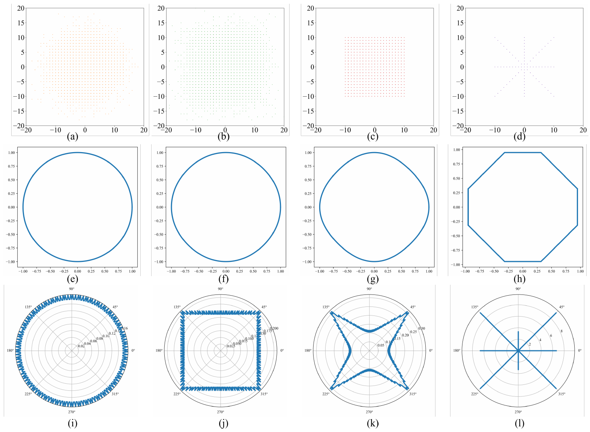
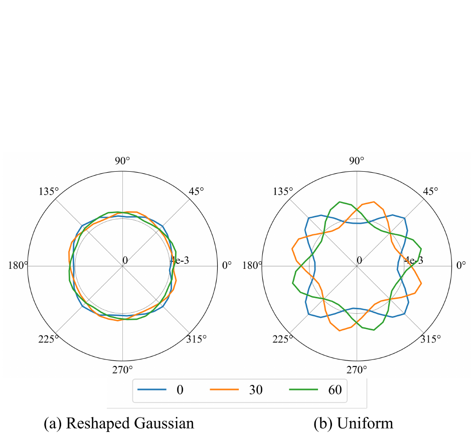
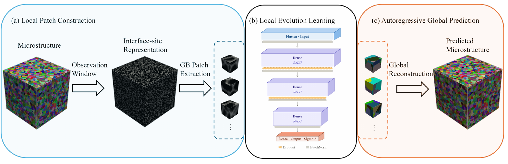
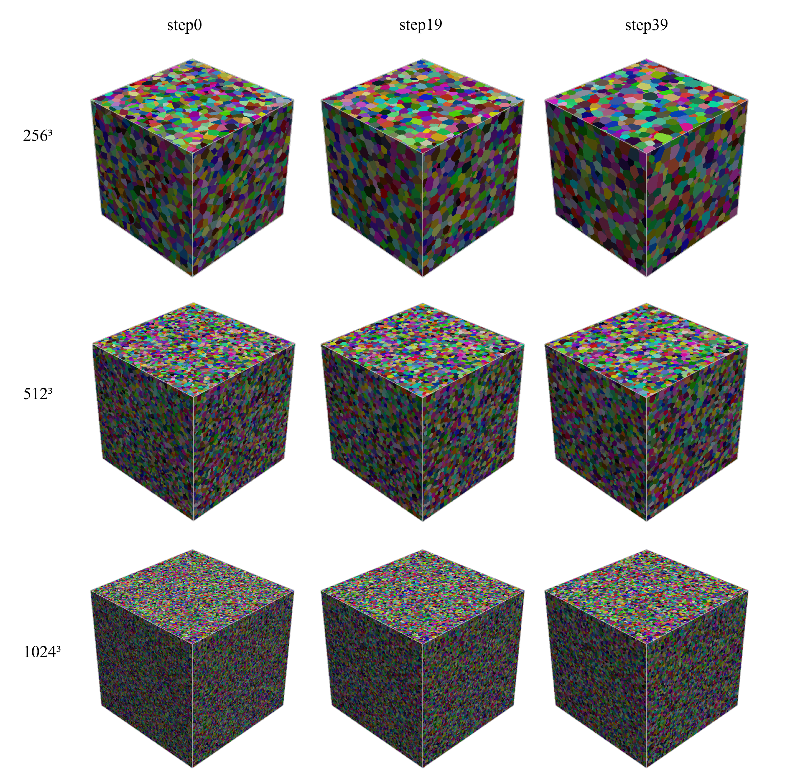
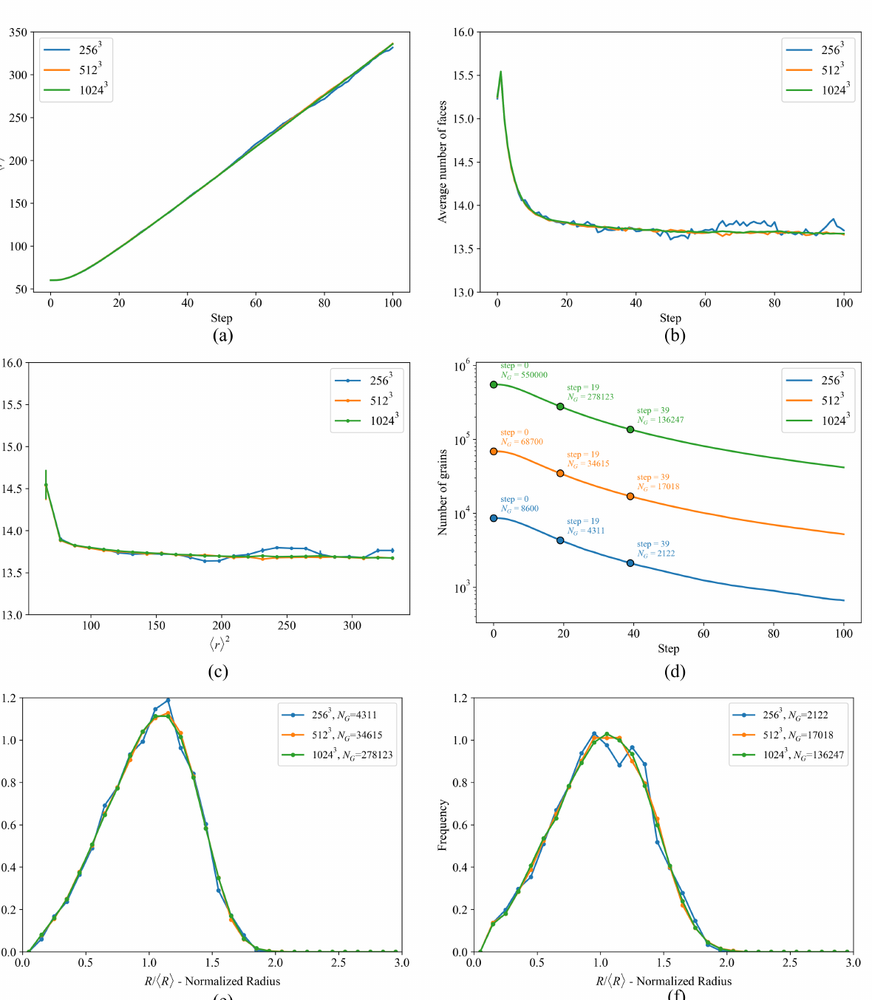
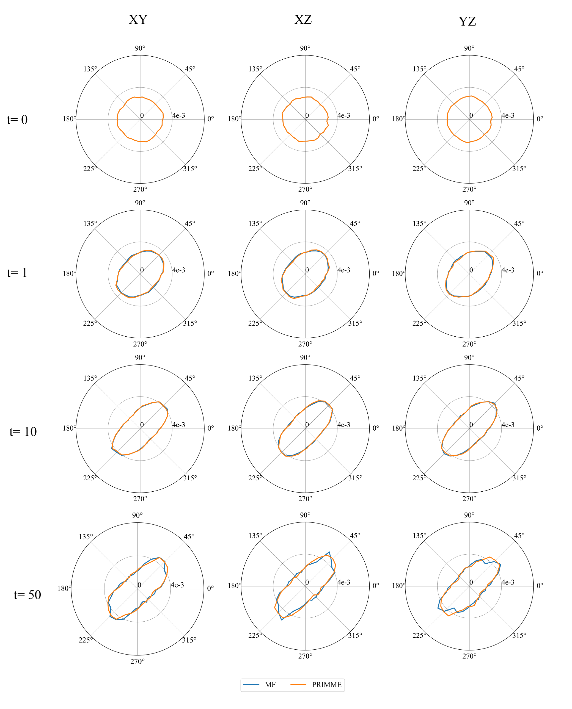
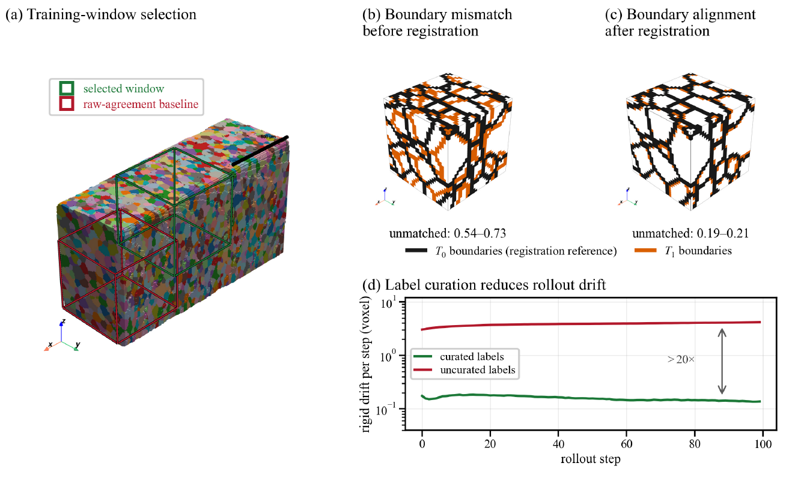
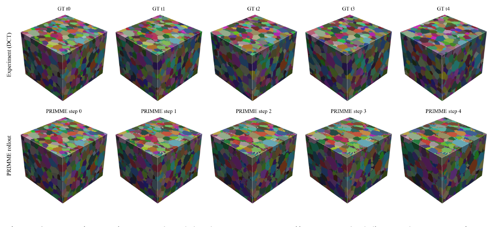
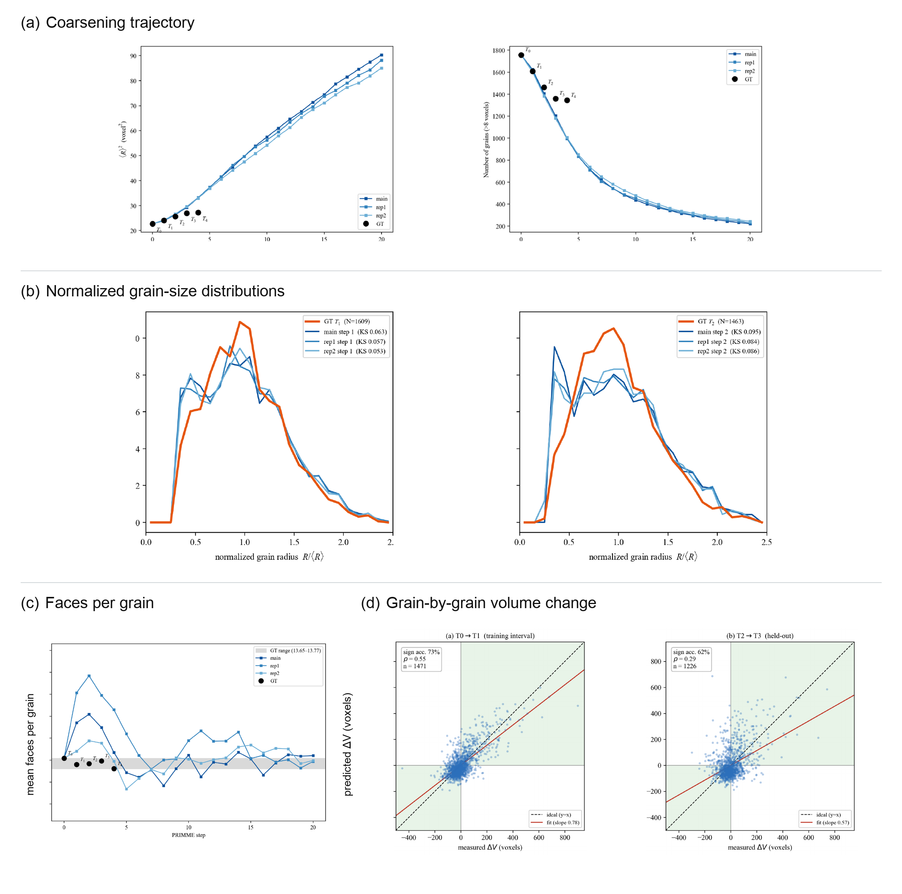

# From Controlled Simulations to 4D Experiments: Local Machine Learning of Grain-Growth Dynamics

## Draft status and evidence convention

This document is a full working draft of the PhD proposal. It distinguishes three levels of research maturity:

- **Completed prior work:** the neighborhood-driven anisotropy and lattice-pinning study and 3D-PRIMME. The 3D-PRIMME manuscript is currently under review.
- **Ongoing work with stable preliminary results:** the experimental-surrogate study, including every result reported in the current manuscript.
- **Proposed future work:** multi-window reliability and uncertainty assessment, paired validation of simulation-trained and experiment-trained surrogates, and the unfinished components of physical interpretation.

Bracketed source notes identify the supporting manuscript, section, figure, and PDF page. Claims requiring sources beyond the three manuscripts remain marked `[NEEDS LITERATURE SUPPORT]`. Prospective thresholds not yet selected remain marked `[NEEDS QUANTITATIVE CRITERION]`.

---

# Abstract

Predicting three-dimensional grain growth requires connecting local grain-boundary evolution to long-time changes in grain size, topology, and morphology. Physics-based simulations can generate the large datasets needed to train machine-learning surrogates, but a surrogate inherits both the intended dynamics and the numerical artifacts of its training source. This dissertation develops a source-aware local-learning framework that progresses from physically controlled stochastic simulations to direct learning from sparse four-dimensional experiments.

The first completed foundation establishes that the geometry and stochastic sampling of a local simulation neighborhood control lattice pinning and inclination-dependent anisotropy. Gaussian sampling suppresses strong lattice-aligned preferences, deliberately reshaped neighborhoods prescribe graded anisotropy, and rotation of the neighborhood rotates the resulting inclination response. These results show that the simulation neighborhood is part of the physical content encoded in training labels, although they do not establish universal material fidelity. [Source: Neighborhood manuscript, §§3-7, Figs. 2-7, PDF pp. 6-17]

The second completed foundation, 3D-PRIMME, demonstrates that a local neural operator can learn controlled mode-filter evolution from minimal temporal supervision. The model reproduces major kinetic and topological trends, learns prescribed inclination dependence, and transfers without retraining from \(100^3\)-voxel training volumes to domains as large as \(1024^3\). However, this performance represents fidelity to the simulation teacher rather than proof of universal grain-growth physics. [Source: 3D-PRIMME manuscript, §§2-5, Figs. 1-8, PDF pp. 2-15]

Ongoing work extends the same architecture to a five-state laboratory diffraction-contrast-tomography dataset. Stable preliminary results demonstrate residual-driven window selection, integer registration without label interpolation, grain linkage, direct training from one experimental interval, replicate rollouts, held-out evaluation, and substantial suppression of artificial drift. Early coarsening and normalized grain-size distributions are reproduced, while late-time slowdown, topology, and some individual-grain responses remain unresolved. [Source: Experimental surrogate manuscript, §§2-5, Figs. 1-6 and Table 1, PDF pp. 3-17]

The proposed research has three aims. Aim 1 will establish reliability across multiple experimental windows and quantify empirical variability due to data partition, model initialization, and key curation choices. Aim 2 will perform two paired validations: simulation reference versus simulation-trained prediction, and experimental reference versus experiment-trained prediction, using the metrics already established in the corresponding manuscripts and adding further metrics as needed. Aim 3 will interpret experimentally learned evolution rules; its detailed hypothesis and methods will be added after the existing interpretation work is supplied. Together, the research will establish when a local learned operator can be trusted relative to its data source and create a defensible basis for subsequent physical interpretation of measured mesoscale evolution.

---

# 1. Introduction and Research Vision

## 1.1 Mesoscale prediction as a local-to-global problem

Grain growth is expressed macroscopically through changes in grain size, size distribution, topology, and morphology, but these observables emerge from local motion and rearrangement near grain boundaries. Predictive modeling must therefore bridge two scales: the local neighborhood in which an interface update occurs and the large spatial and temporal domain over which those updates accumulate into measurable microstructural evolution. Direct three-dimensional simulation over experimentally relevant volumes and long time horizons is computationally demanding, motivating learned surrogates that can reproduce local updates more efficiently. [Source: 3D-PRIMME manuscript, §1, PDF pp. 1-2]

Machine learning does not remove the need to define physical content. A supervised model learns the relationships contained in its labels. When the labels come from simulation, the learned operator is limited by the simulator's assumptions, discretization, stochastic policy, and numerical artifacts. When the labels come from experiment, the model may also learn acquisition motion, reconstruction errors, segmentation changes, clipping, and identity-linkage failures as if they were physical boundary motion. The central problem is therefore not merely whether a network can fit voxel transitions, but whether the entire path from data source to local operator to long rollout is physically and statistically trustworthy.

## 1.2 Overarching research question

This dissertation asks:

> **How can local, physics-guided machine learning progress from learning physically controlled simulation dynamics to learning reliably from sparse 4D experimental observations, and ultimately support physical interpretation of mesoscale grain growth?**

The question is addressed through a sequence of progressively removed assumptions:

1. diagnose how a stochastic simulation neighborhood determines the physical content and artifacts of simulation labels;
2. test whether a scalable local surrogate can learn those controlled simulation rules;
3. replace simulation labels with curated experimental evolution;
4. determine whether each learned operator reproduces its own reference domain;
5. interpret only those experimentally learned relationships that pass the relevant reliability tests.

## 1.3 Central hypothesis

The central hypothesis is:

> **Local grain-growth evolution is sufficiently encoded in carefully curated neighborhood observations to support reliable three-dimensional prediction across held-out experimental conditions; empirical uncertainty and sensitivity assessment can identify the domain in which those predictions are trustworthy, while paired validation of simulation-trained predictions against simulation and experiment-trained predictions against experiment can establish which learned relationships are reliable enough for subsequent physical interpretation.**

This hypothesis does not assume that agreement with a simulator proves agreement with nature, that one selected experimental window establishes generalization, or that accurate prediction automatically identifies a mechanism. Instead, it makes reliability conditional on the data source, validation level, and domain of applicability.

## 1.4 Dissertation logic and significance

The dissertation follows the causal chain:

> **Neighborhood-controlled simulation physics  
> \(\rightarrow\) scalable simulation-trained surrogate  
> \(\rightarrow\) reliable experimental learning  
> \(\rightarrow\) paired reference-surrogate validation  
> \(\rightarrow\) physical interpretation**

The first two stages are completed foundations. They establish that local simulation rules can be physically diagnosed and that a compact local architecture can learn and scale those rules. The experimental study then demonstrates that the architecture can be trained directly from measured grain-ID evolution after careful curation. The proposed work addresses what the preliminary study cannot yet establish: cross-window reliability, a defensible uncertainty/domain-of-applicability framework, paired validation against simulation and experiment, and eventually a testable interpretation of experimentally learned responses.

---

# 2. Completed Foundations: From Simulation Physics to 3D Surrogate Learning

**Research status: COMPLETED PRIOR WORK**

## 2.1 Neighborhood-dependent simulation physics

### Stochastic update rules and neighborhood geometry

Stochastic lattice and voxel models represent a microstructure through discrete grain identities and update those identities according to local rules. Their computational accessibility makes them useful for generating long sequences and large training sets, but their effective behavior depends on more than the nominal physical objective. Neighborhood shape, lattice discretization, sampling count, pseudo-temperature, and update acceptance can alter inclination preference, pinning, morphology, and grain-level statistical scatter. [Source: Neighborhood manuscript, §§1-3 and §§5-6, PDF pp. 3-7 and 10-16]

The conventional Monte Carlo Potts model evaluates a local Hamiltonian in a fixed neighborhood, proposes an identity change, and accepts or rejects it based on the resulting energy change and pseudo-temperature. For site \(i\), the local energy and acceptance rule are

\[
\begin{aligned}
\mathcal{H}_i
&=
\frac{1}{2}\sum_{j\in\mathcal{N}_i}
\gamma_{ij}\left(1-\delta_{s_i,s_j}\right),\\
\Delta\mathcal{H}_i
&=
\mathcal{H}'_i-\mathcal{H}_i,\\
p(\Delta\mathcal{H}_i)
&=
\begin{cases}
\exp\!\left(-\dfrac{\Delta\mathcal{H}_i}{kT}\right),
& \Delta\mathcal{H}_i>0,\\[4pt]
1, & \Delta\mathcal{H}_i\le 0,
\end{cases}
\end{aligned}
\]

Here, \(s_i\) is the grain identity at site \(i\), \(\mathcal{N}_i\) is its neighborhood, \(\gamma_{ij}\) is the relative boundary energy, \(T\) is the pseudo-temperature, and \(\delta\) is the Kronecker delta. The mode filter instead samples sites from a positive symmetric kernel and assigns the most frequent sampled identity. Neighborhood-driven MCP replaces the fixed Moore neighborhood with samples from an arbitrary probability mass function while retaining the MCP acceptance rule. These methods provide a controlled setting in which the influence of neighborhood geometry can be separated from other parts of the update policy. [Source: Neighborhood manuscript, §§2-3, Eqs. 1-12, PDF pp. 4-7]

The neighborhood study investigates why stochastic grain-growth models develop lattice pinning and inclination-dependent artifacts. Its central contribution is to show that the local neighborhood is not a neutral numerical stencil. The first absolute moment of the sampling kernel defines an effective inclination-dependent interfacial energy, which can be connected through a Wulff construction to equilibrium shape and inclination distribution. Discrete sampling and stochastic update policy determine how sharply that theoretical response is expressed. [Source: Neighborhood manuscript, §§3.2-3.3, Eqs. 9-12, PDF pp. 6-7]

For a continuous two-dimensional kernel \(K(x,y)\), the inclination-dependent interfacial energy and its discrete-lattice counterpart are

\[
\begin{aligned}
\gamma(\theta)
&=
\int_{\mathbb{R}^2}
K(x,y)\,
\left|x\cos\theta+y\sin\theta\right|
\,\mathrm{d}x\,\mathrm{d}y,\\
\gamma_d(\theta)
&=
\sum_{m=1}^{M}
K(x_m,y_m)\,
\left|x_m\cos\theta+y_m\sin\theta\right|.
\end{aligned}
\]

Thus, neighborhood geometry enters the effective physics through a directional first absolute moment. The corresponding equilibrium Wulff shape is

\[
W=
\bigcap_{\theta\in(0,2\pi]}
\left\{
(x,y)\in\mathbb{R}^2:
x\cos\theta+y\sin\theta\le\gamma(\theta)
\right\}.
\]

These relations make the causal chain explicit: changing \(K\) changes \(\gamma(\theta)\), which changes the preferred equilibrium shape and its boundary-inclination population.

*Sampling neighborhoods (top), corresponding theoretical Wulff shapes (middle), and predicted inclination distributions (bottom) for the neighborhood families evaluated in the completed study. Adapted from Fig. 1 of the Neighborhood manuscript.*

For surrogate learning, this result reframes simulator design as training-data governance. A neural operator trained on simulation does not see an abstract law; it sees updates generated by a particular kernel and update policy. Artificial directional preference in the simulator becomes an artificial directional preference available for learning. Conversely, a deliberately anisotropic neighborhood can provide controlled labels for testing whether a model recovers a prescribed response.

### Methods

The completed study compares MCP, N-MCP, and MF evolution in \(2400\times2400\)-pixel domains initialized from a common 20,000-grain Voronoi tessellation. Comparisons are performed at matched grain counts because neighborhood choice changes the evolution rate. Gaussian, reshaped-Gaussian, square, and star-shaped sampling neighborhoods are used to vary inclination dependence systematically. The analysis evaluates theoretical and simulated inclination distributions, aggregate anisotropy magnitude, equilibrium morphology, rotation of the imposed anisotropy, von Neumann-Mullins behavior, statistical scatter, and computational cost. [Source: Neighborhood manuscript, §4, PDF pp. 7-9; §§5-6 and Supplementary materials, PDF pp. 10-21]

### Completed results

Conventional zero-temperature MCP exhibits strong lattice-aligned boundary populations. Increasing pseudo-temperature softens this response, while N-MCP with Gaussian sampling yields an approximately circular inclination distribution in the tested conditions. Progressing from Gaussian to reshaped Gaussian, square, and star neighborhoods produces progressively stronger directional preferences. MF exhibits the same qualitative dependence: the Gaussian case is nearly isotropic, while non-circular neighborhoods generate stronger anisotropy. [Source: Neighborhood manuscript, §§5.1-5.3, Figs. 2-4, PDF pp. 10-13]

The rotation test provides the clearest causal evidence. Rotating reshaped-Gaussian and uniform MF neighborhoods by 0, 30, and 60 degrees rotates the measured inclination response accordingly. This separates the orientation of the neighborhood from the fixed orientation of the pixel grid. The work further shows that neighborhood geometry and algorithmic stochasticity affect different observables: MF produces substantially lower scatter in the reported von Neumann-Mullins comparison than MCP and N-MCP, while changing the N-MCP neighborhood alone does not eliminate grain-level scatter. Increasing the number of MF samples improves statistical stability. [Source: Neighborhood manuscript, §§6.1-6.3, Figs. 5-7, PDF pp. 13-16; Supplementary Figs. 8-9 and Table 1, PDF pp. 19-21]

*Measured inclination distributions after rotating reshaped-Gaussian and uniform MF neighborhoods by \(0^\circ\), \(30^\circ\), and \(60^\circ\). The response rotates with the neighborhood, providing a causal separation from the fixed pixel lattice. Adapted from Fig. 6 of the Neighborhood manuscript.*

### Role and claim boundary

This work establishes control with respect to lattice pinning, artificial inclination preference, and selected topological/statistical behavior. It does not establish correct material-specific mobility, misorientation dependence, boundary energy, or agreement with experimental alumina. The defensible dissertation claim is therefore:

> The neighborhood study provides the physical basis for selecting and diagnosing the simulation teacher used for surrogate training.

It should not be claimed that the study directly proved improved 3D-PRIMME accuracy, because no surrogate was trained on paired “poor” and “improved” neighborhood datasets. Its enabling role is conceptual and methodological: it identifies which local rules are present in the simulation labels and provides controlled isotropic and anisotropic teachers for the next stage.

## 2.2 Simulation-trained 3D-PRIMME

**Research status: COMPLETED PRIOR WORK; MANUSCRIPT UNDER REVIEW**

A local surrogate represents evolution through a fixed neighborhood operator rather than a global map over the entire volume. This creates three potential advantages. First, a small three-dimensional volume contains many local boundary-centered training examples. Second, the learned operator can be applied to a larger domain because its input size does not depend on global volume dimensions. Third, repeated application provides temporal rollouts beyond the training interval. These benefits are meaningful only if locality retains sufficient boundary context and if rollout errors do not accumulate into incorrect kinetics or topology. [Source: 3D-PRIMME manuscript, §§1-2 and §4, PDF pp. 1-5 and 13-14]

Validation must therefore occur at several levels:

- voxel and boundary-update agreement;
- field morphology and rigid drift;
- population kinetics such as grain count and squared mean radius;
- normalized grain-size distributions;
- topology and face-count behavior;
- individual-grain growth or shrinkage;
- inclination-dependent response where supported.

Agreement at one level does not imply agreement at another. A rollout may reproduce a size distribution while making incorrect individual updates or retaining the wrong topology. [Source: 3D-PRIMME manuscript, §§2.3-3.5, PDF pp. 5-13; Experimental surrogate manuscript, §4, PDF pp. 9-15]

### Architecture and simulation supervision

3D-PRIMME learns three-dimensional grain evolution from local boundary geometry. Grain identities are transformed into an interface-site representation that counts unlike neighbors in a local observation window. At site \(i\) and time \(t\), the representation and the candidate-update target are

\[
\begin{aligned}
S_i^{(t)}
&=
\sum_{j\in\mathcal{N}_o(i)}
\left(1-\delta_{ij}^{(t)}\right),
\qquad
\delta_{ij}^{(t)}
=
\mathbf{1}\!\left[s_i^{(t)}=s_j^{(t)}\right],\\
y_{ij}^{(t)}
&=
\begin{cases}
1, & s_i^{(t+1)}=s_j^{(t)},\\
0, & s_i^{(t+1)}\ne s_j^{(t)},
\end{cases}
\qquad j\in\mathcal{N}_a(i).
\end{aligned}
\]

Here, \(\mathcal{N}_o(i)\) and \(\mathcal{N}_a(i)\) are the observation and action windows. The network \(Y_\vartheta\) is fitted with the local squared-error objective

\[
L_i^{(t)}
=
\frac{1}{\left|\mathcal{N}_a(i)\right|}
\sum_{j\in\mathcal{N}_a(i)}
\left|
Y_\vartheta\!\left(S_i^{(t)},S_j^{(t)}\right)
-y_{ij}^{(t)}
\right|^2 .
\]

Boundary-centered patches are extracted, and the trained network maps each local representation to candidate grain-identity update scores within the action window. Local predictions are assembled into the next global grain-ID map, and the operator is then applied autoregressively. Because the observation and action windows have fixed size, the learned operator is not tied to the global training-volume dimensions. [Source: 3D-PRIMME manuscript, §2.2, Fig. 1, Table 1, and Eqs. 5-7, PDF pp. 3-5]

*3D-PRIMME workflow: local patch construction from the grain-ID field, learning of local evolution scores, and autoregressive reconstruction of the global predicted microstructure. Adapted from Fig. 1 of the 3D-PRIMME manuscript.*

Training and evaluation use three-dimensional MF data. The reported dataset contains 200 isotropic sequences and a corresponding set of inclination-dependent sequences. Each sequence starts from a different 512-grain Voronoi structure in a \(100^3\)-voxel volume and evolves for 100 simulation steps, while a training set uses only two consecutive states from one or more sequences. For the inclination-dependent data, the Gaussian sampling covariance is

\[
\boldsymbol{\Sigma}
=
\begin{pmatrix}
a & b & b\\
b & a & b\\
b & b & a
\end{pmatrix},
\qquad
a=25,\quad b=20,
\]

which biases the MF neighborhood along \(\mathbf{u}_{111}=(1,1,1)/\sqrt{3}\). The isotropic and inclination-dependent datasets therefore provide controlled teachers for testing whether the learned local operator recovers both scalar coarsening behavior and a prescribed directional response. No experimental microstructure is used in this completed study. [Source: 3D-PRIMME manuscript, §2.1, Eqs. 1-4, PDF pp. 2-3]

### Completed performance

#### Local-context sensitivity and training variability

Window sensitivity tests show that all evaluated settings recover approximately linear coarsening, but the observation window affects the growth rate more strongly than the action window. The \(N_o=9\), \(N_a=9\) setting produces the smallest reported relative kinetic error, 2.85%, and is used as the default. Ten replicate models trained on one two-state sequence show small spread in squared mean radius, average face count, topology-size relation, and voxel accuracy, although uncertainty grows with rollout time. [Source: 3D-PRIMME manuscript, §§3.1-3.2, Figs. 2-3, PDF pp. 6-8]

Two of the quantitative readouts can be written as

\[
\begin{aligned}
\left\langle r(t)\right\rangle^2
&\approx
\left\langle r(0)\right\rangle^2+K_g t,\\
\operatorname{Acc}(t)
&=
\frac{1}{N}
\sum_{i=1}^{N}
\mathbf{1}\!\left[\hat{s}_i^{(t)}=s_i^{(t)}\right].
\end{aligned}
\]

where the first relation is the parabolic coarsening diagnostic, \(K_g\) is the fitted growth-rate coefficient, and the second is voxel-wise agreement between predicted and reference grain labels. The coarsening relation is used as a kinetic diagnostic rather than a claim of universal continuous-time calibration.

#### Spatial and temporal extrapolation

The distinction between training support and inference scale is central to 3D-PRIMME. The network is trained from local patches extracted from \(100^3\)-voxel volumes and requires only one transition between two consecutive states. During inference, the same fixed local operator is applied repeatedly and independently of the global domain dimensions. A model trained at \(100^3\) is therefore applied without retraining to \(256^3\), \(512^3\), and \(1024^3\) domains containing approximately 8,600, 68,700, and 550,000 initial grains, respectively. [Source: 3D-PRIMME manuscript, §3.3, Fig. 4, PDF pp. 7-9]

*Visual evidence of spatial and temporal extrapolation by 3D-PRIMME. Representative \(256^3\), \(512^3\), and \(1024^3\) domains are shown at rollout steps 0, 19, and 39; the later states correspond approximately to one-half and one-quarter of the initial grain populations. The model was trained on \(100^3\) volumes and applied to all three larger domains without retraining. The cubes are displayed at a common visual size; row labels give the actual domain sizes. Adapted from Fig. 4 of the 3D-PRIMME manuscript.*

The visual coarsening is accompanied by quantitative collapse across domain sizes. The tested scales exhibit closely overlapping squared-mean-radius trajectories, topological evolution, and normalized radius distributions at matched coarsening states. A \(1024^3\) rollout remains statistically stable for 100 steps, by which point 41,674 grains, or 7.6% of the initial population, remain. [Source: 3D-PRIMME manuscript, §3.3, Figs. 4-5, PDF pp. 7-10]

*Statistical consistency of 3D-PRIMME rollouts across \(256^3\), \(512^3\), and \(1024^3\) domains, including coarsening kinetics, topology, grain-count decay, and normalized grain-size distributions. Adapted from Fig. 5 of the 3D-PRIMME manuscript.*

Together, the morphology and statistical figures distinguish two levels of evidence: the first shows plausible three-dimensional evolution over increasing domain size, while the second shows that kinetic, topological, and distributional observables remain consistent. The demonstrated "temporal extrapolation" is autoregressive deployment beyond the two-state training interval within the MF setting; it is not a claim of calibrated physical-time prediction for an unseen material.

#### Data efficiency under limited temporal supervision

Models trained on 1, 10, or 50 two-state sequences are evaluated against an independent set of ten MF simulations under a fixed number of optimizer updates. All three training-set sizes preserve approximately linear coarsening and similar face-count behavior. Ten sequences give the highest voxel accuracy and smallest replicate spread in that comparison, whereas the 50-sequence case coarsens more slowly and shows larger variability. The latter observation is treated as a training-design result—possibly reflecting redundancy, stochastic diversity, or insufficient optimization under the fixed update budget—rather than evidence that additional data are intrinsically harmful. [Source: 3D-PRIMME manuscript, §3.4, Fig. 6, PDF pp. 8-11]

#### Recovery of prescribed inclination dependence

The inclination-dependent test asks for more than recovery of scalar coarsening statistics. The anisotropic MF kernel produces an evolving directional signature, but boundary inclination is not supplied to 3D-PRIMME as an explicit input feature. Nevertheless, the initially near-circular distributions develop the expected elongated response, and the 3D-PRIMME curves remain close to the MF reference in the XY, XZ, and YZ projection planes through rollout step 50. This agreement indicates that the interface-site representation retains sufficient local geometry for the network to infer the teacher's direction-dependent update rule. [Source: 3D-PRIMME manuscript, §3.5, Figs. 7-8, PDF pp. 10-13]

*Recovery of prescribed inclination dependence. MF reference distributions (blue) and 3D-PRIMME predictions (orange) are compared in the XY, XZ, and YZ projection planes at rollout steps 0, 1, 10, and 50. Agreement across the three projections shows that the model reproduces the directional response encoded by the anisotropic MF teacher even though inclination is not provided explicitly as an input. Adapted from Fig. 8 of the 3D-PRIMME manuscript.*

### Scientific lesson and limitation

The completed study demonstrates that a compact local representation contains sufficient information to reproduce major kinetic, topological, and inclination-dependent features of the MF teacher over spatial and temporal scales larger than those used for training. It also establishes that local context must be selected carefully: locality does not mean that an arbitrarily small or large neighborhood is equally informative.

The claim is nevertheless bounded by the supervision source. The model learns MF evolution, not universal grain-growth truth. Its geometry-only representation does not explicitly encode crystallographic misorientation, boundary energy, or mobility. Its successful recovery of anisotropy demonstrates learning of a prescribed simulation response, not discovery of an unknown experimental mechanism. [Source: 3D-PRIMME manuscript, §§3.5-5, PDF pp. 10-15]

These limitations motivate the next stage. Once scalable local learning is technically feasible, the central question becomes whether the operator can be trained directly from measured evolution, where relevant behavior is not prescribed by a simulator.

## 2.3 What the completed foundations establish—and what they cannot establish

A simulation-trained surrogate is constrained twice: first by the simulator's representation of the material and then by the approximation error of the learned model. Improving agreement between 3D-PRIMME and MF reduces the second error but cannot remove the first. A high-fidelity surrogate of an idealized simulator remains an idealized model.

The completed studies make this distinction observable. The neighborhood work shows that local kernels can introduce, suppress, or prescribe inclination dependence. 3D-PRIMME then shows that a neural operator can recover the resulting simulated response. Together, they demonstrate both the strength and the ceiling of simulation supervision: controlled rules can be learned and scaled, but missing or incorrectly represented mechanisms cannot be recovered from labels that do not contain them.

Direct experimental learning is therefore scientifically necessary, not simply a source of additional data. It changes the teacher from a prescribed stochastic model to measured microstructure evolution. That shift can expose an effective response that integrates material-specific factors absent from a geometry-only simulator, but it also removes the clean control available in synthetic data. Experimental labels include uncertainty, incomplete observability, and acquisition artifacts. The next challenge is to determine whether those labels can support a reliable local operator without confusing measurement structure with physical evolution.

The dissertation accordingly distinguishes three levels of agreement:

1. **Representation agreement:** the predicted voxel or boundary update matches a reference label.
2. **Mesoscale agreement:** rollouts reproduce kinetics, distributions, topology, and grain-level trends.
3. **Physical interpretation:** reproducible learned dependencies correspond to measurable physical variables and survive controlled tests.

Success at one level is necessary but not sufficient for the next.

---

# 3. Experimental Foundation and Remaining Research Gap

## 3.1 Challenges of learning from sparse 4D experiments

### Structured label uncertainty

Experimental grain-ID maps are not automatically valid training pairs. Rigid translation and rotation produce apparent boundary displacement. Residual non-rigid distortion can create a spatially varying update field. Surface recession changes the common material volume. Grain identities can be lost or incorrectly linked between scans. Small grains may fall below detection thresholds, and segmentation churn can create or remove apparent grains. If these effects are passed directly to an autoregressive model, the network can learn them as spurious dynamics. [Source: Experimental surrogate manuscript, §§1-3 and §5, PDF pp. 1-9 and 15-17]

Label-preserving preprocessing is therefore part of the scientific method. Continuous interpolation is inappropriate for categorical grain identities because it produces values that do not correspond to grains. Registration must move whole labels, preserve identity, and expose residual uncertainty rather than hide it through smoothing.

Unlike independent label noise, these effects can produce a spatially organized apparent update rule that is repeatedly amplified during autoregressive rollout. Direction-sensitive registration residuals and rollout drift are therefore as important as aggregate fit metrics.

*Experimental-label curation and its diagnostics: residual-driven training-window selection, boundary mismatch before and after integer registration, and the reduction in learned rollout drift after curation. Adapted from Fig. 1 of the Experimental surrogate manuscript.*

### Spatial abundance and temporal scarcity

Laboratory diffraction-contrast tomography supplies voxelized three-dimensional grain maps at a small number of successive states. The present dataset is spatially rich but temporally sparse: one pair of volumes contains hundreds of thousands of local boundary-centered patches, but the dataset contains only five independent time states. This asymmetry makes local learning feasible while limiting claims of generalization. Overlapping patches from one transition increase the optimization sample count, but they do not replace independent experimental windows or time intervals. Random voxel-level train/validation splits test whether the architecture fits the selected pair; they do not demonstrate cross-window or cross-material transfer. [Source: Experimental surrogate manuscript, §§1-3, PDF pp. 1-9]

The correct unit of future validation is therefore the experimental partition—window, time pair, spatial block, or linked grain—not the individual overlapping voxel alone. Aim 1 is designed around this principle.

### Multilevel validation

Experimental reliability cannot be decided with one scalar score. The current study shows why. Grain-size distributions can agree while topology remains biased; an apparently stable rollout can miss late experimental slowdown; aggregate coarsening can be plausible while individual-grain magnitude is underpredicted. Directional drift can reveal registration artifacts that distribution metrics miss. The proposed work will therefore preserve a multilevel evaluation matrix rather than collapse all outcomes into a single accuracy number.

Broader background on curvature-driven growth, diffraction imaging, uncertainty calibration, and scientific machine learning will be added with external literature in the next revision. `[NEEDS LITERATURE SUPPORT]`

## 3.2 Experimental data curation and direct training

**Research status: ONGOING WORK WITH STABLE PRELIMINARY RESULTS**

### Experimental data and curation

The ongoing study uses a five-state laboratory DCT grain-growth dataset. The full reconstruction contains \(549\times149\times211\) voxels. A candidate \(100^3\) analysis window is selected through a residual-driven search and then trimmed in place to \(100\times95\times84\) voxels so that all registered states remain inside the material. The window contains 1,757 grains initially and 1,345 grains after four intervals, while the reported mean radius increases by approximately 10%. [Source: Experimental surrogate manuscript, §2, PDF pp. 3-7]

Window selection is based on post-registration residual and displacement-gradient amplitude rather than raw inter-frame agreement. The selected window ranks 15th among 831 candidates under that objective, whereas the raw-agreement baseline ranks last. Registration uses a rounded affine displacement field so that whole categorical grain labels are copied without interpolation. This reduces unmatched boundary fractions on three visible faces from 0.54-0.73 to 0.19-0.21 and leaves residual displacement no larger than 0.05 voxel per axis. The curation removes 87% of the dominant rotation-induced displacement ramp and trims the analysis volume to remain interior as the surface recedes. [Source: Experimental surrogate manuscript, §2 and Fig. 1, PDF pp. 4-7]

The integer displacement applied at voxel position \(\mathbf{x}\) is

\[
\boldsymbol{\delta}(\mathbf{x})
=
\operatorname{round}
\left[
\boldsymbol{\phi}
+\mathbf{G}\left(\mathbf{x}-\mathbf{c}\right)
\right],
\]

where \(\boldsymbol{\phi}\) is the remeasured fractional offset, \(\mathbf{G}\) is the fitted displacement-gradient tensor, and \(\mathbf{c}\) is the window center. Componentwise rounding ensures that registration copies existing categorical labels rather than synthesizing interpolated grain identities.

Grain identities are linked between full-volume frames before registration using greedy one-to-one maximum-overlap matching. For the training pair, 90.4% of T1 grains and 97.4% of T1 voxels inherit T0 identities. The remaining 2.6% of T1 voxels generate all-zero target maps rather than fabricated identity assignments. [Source: Experimental surrogate manuscript, §§2-3, PDF pp. 7-8]

### Direct experimental training

The unmodified 3D-PRIMME architecture is trained on the T0-to-T1 transition. A \(9^3\) observation and \(9^3\) action neighborhood yield 729 input/output features per boundary-centered sample. The training pair supplies 797,712 local samples, split randomly 80/20 for optimization monitoring, and three independent models are trained from different initializations. T2-T4 are held out from fitting, although all five frames are used to define the common interior field of view. [Source: Experimental surrogate manuscript, §3, PDF pp. 8-9]

The experiment-trained model uses the same interface representation, candidate-update target, and squared-error loss defined in the simulation-trained 3D-PRIMME formulation above; for this training pair, \(t=0\) and \(t+1=1\) correspond to T0 and T1. The mathematical operator is unchanged, while the grain-ID fields supplying \(S_i^{(t)}\) and \(y_{ij}^{(t)}\) now come from curated measurements rather than MF simulation.

This design establishes direct-training feasibility. It does not yet establish spatial generalization because all fitting samples come from one window, nor complete temporal independence because later frames contribute to the common-volume definition.

## 3.3 Stable preliminary results

The learned rollouts remain visually coherent over the experimental window. Large grains grow, small grains disappear, boundaries flatten, and only a short-lived single-voxel speckle artifact is reported. Early aggregate coarsening is also reproduced: after one rollout step, the representative prediction retains 1,624 grains compared with 1,609 in experiment. The prediction then diverges as the experiment slows between T3 and T4 while the fixed two-hour learned operator maintains a steadier rate. The manuscript does not establish a continuous-time calibration. [Source: Experimental surrogate manuscript, §4, Figs. 2-3, PDF pp. 9-11]

*Experimental states T0–T4 (top) and the corresponding experiment-trained PRIMME rollout steps 0–4 (bottom), shown with a shared grain-ID color map for one representative replicate. Adapted from Fig. 2 of the Experimental surrogate manuscript.*

Normalized grain-size distributions show encouraging held-out agreement. For normalized radius \(z=R/\langle R\rangle\), the reported two-sample Kolmogorov-Smirnov statistic is

\[
D_{\mathrm{KS}}
=
\sup_z
\left|
\widehat{F}_{E}(z)
-\widehat{F}_{\widehat{E}}(z)
\right|,
\]

where \(\widehat{F}_{E}\) and \(\widehat{F}_{\widehat{E}}\) are the empirical cumulative distributions for the experimental reference and the experiment-trained rollout at matched grain count. Across three later states and three model replicates, reported \(D_{\mathrm{KS}}\) values range from 0.071 to 0.095. When analysis is restricted to grains larger than the approximately \(20\,\mu\text{m}\) experimental confidence limit, the values decrease to 0.025-0.059. Because the experiment slows, all later frames are paired with rollout step 2 under the matched-grain-count analysis. These comparisons support distribution-shape consistency but do not identify a unique local rule. [Source: Experimental surrogate manuscript, §4, Fig. 4, PDF pp. 10-12]

Topology reveals a clear current limitation. At rollout steps paired with the held-out states, predicted face counts remain above the experimental band. The draft associates this difference with the transient arg-max speckle and sensitivity to small grains. Individual-grain analysis is feasible only where identity linkage remains sufficiently reliable: growth/shrinkage sign accuracy is 72-73% on the training interval and 62-63% on the usable T2-to-T3 held-out interval, with regression slopes of 0.78 and 0.57, respectively. The model therefore captures part of the direction of grain evolution while underpredicting its magnitude. [Source: Experimental surrogate manuscript, §4, Figs. 5-6, PDF pp. 11-14]

*Multilevel experimental evaluation: (a) coarsening trajectory, (b) normalized grain-size distributions, (c) faces per grain, and (d) linked grain-by-grain volume change. The panels retain both favorable results and current limitations. Adapted from Figs. 3–6 of the Experimental surrogate manuscript.*

Curation strongly suppresses artificial translation. Mean per-step drift across the three models is approximately \((-0.02,+0.13,-0.09)\) voxels along \((x,y,z)\), compared with approximately 3.5 voxels per step for uncurated labels. The residual direction is consistent with the known rotational shear, which demonstrates why directional diagnostics must accompany aggregate accuracy. A 100-step extrapolation remains numerically stable and decreases monotonically to 38 grains, but this long rollout has no experimental reference and is not treated as physical validation. [Source: Experimental surrogate manuscript, §4, Table 1, PDF pp. 14-15]

## 3.4 Remaining gap motivating the proposed aims

The stable results establish that:

- categorical 4D experimental data can be converted into local training labels without interpolation;
- residual-driven curation, registration, trimming, and linkage can substantially reduce coherent artifacts;
- one experimental transition can supply enough local samples to train the existing architecture;
- later experimental states can support multilevel evaluation;
- early kinetics, size-distribution shape, individual-grain sign, topology, and directional drift provide complementary evidence.

They do not establish:

- reliability beyond the selected field of view;
- cross-specimen or cross-material transfer;
- correct late-time kinetics;
- correct held-out topology;
- calibrated predictive uncertainty;
- physical mechanism discovery.

These limitations directly define Aim 1.

---

# 4. Proposed Research: Specific Aims

The remaining research is organized by scientific dependency rather than by manuscript. Aim 1 establishes when experimental learning is trustworthy. Aim 2 evaluates each learned operator against its own reference domain. Aim 3 will interpret only relationships that survive those reliability tests.

## 4.1 Aim 1: Establish reliable and generalizable learning from sparse 4D experiments

**Status:** Single-window results are stable preliminary evidence; multi-window analysis is ongoing; core reliability and empirical uncertainty analysis are proposed.

### Scientific question

Under what curation, registration, linkage, training, and validation conditions can an experiment-trained local surrogate be trusted beyond its exact training pair and selected field of view?

### Hypothesis

If voxel-level labels are curated with direction-sensitive registration checks and evaluated across independent experimental windows and temporal partitions, then experiment-trained local operators will reproduce held-out evolution at field, population, topology, and individual-grain levels within a definable domain of applicability. Empirical variability arising from window selection, model initialization, and key curation choices will increase when the model is evaluated under less-supported conditions and will identify cases in which prediction should be qualified or withheld.

### Rationale

The current experimental manuscript establishes direct-training feasibility but does not establish generalization. All training data originate from one selected window and one two-hour transition. Three initialization replicates characterize optimization variability, while threshold, padding, drift, and readout analyses reveal several single-window sensitivities. The next contribution is not simply to add more diagnostics to that window. It is to determine whether the learned operator and its conclusions reproduce across experimentally meaningful data partitions.

### Completed preliminary evidence

Stable preliminary evidence includes residual-driven window selection, whole-label integer registration, interior-volume trimming, grain linkage, direct T0-to-T1 training, three model replicates, held-out T2-T4 evaluation, grain-size and topology comparisons, individual-grain tests where linkage permits, and directional rollout-drift analysis. These results establish feasibility and provide the baseline metrics for the proposed multi-window work. [Source: Experimental surrogate manuscript, §§2-5, Figs. 1-6 and Table 1, PDF pp. 3-17]

### Boundary between preliminary and proposed work

| Dimension | Stable preliminary work | Aim 1 extension |
|---|---|---|
| Spatial coverage | One curated experimental window | Multiple prespecified windows from the current volume |
| Replication | Three model initializations | Variability across windows, models, and key curation choices |
| Validation | Later states in the same field of view | Grouped spatial and temporal validation |
| Sensitivity | Detection threshold, padding, drift, and readout within one window | Cross-window robustness and domain of applicability |
| Scientific claim | Feasibility of direct experimental training | Conditions under which prediction is reliable beyond the original pair/window |

### Proposed methodology

**1. Define a minimum multi-window dataset.** Additional candidate windows will be selected from the current DCT volume using the same residual-driven philosophy as the preliminary study. Selection criteria will be fixed before model comparison and will include interior-volume support, post-registration residual, displacement-gradient amplitude, boundary content, and linkage feasibility. The final number and placement of windows will depend on their measured quality. `[AUTHOR INPUT REQUIRED]`

**2. Apply a consistent label-preserving curation pipeline.** Each selected window will undergo whole-label integer registration, in-place trimming to a common interior volume, and full-volume grain linkage. Registration residuals, unmatched boundary fractions, linkage yield, and retained volume will be recorded rather than treated as hidden preprocessing details.

**3. Define grouped training and validation partitions.** Partitions will be organized by window and time pair so that overlapping voxels from one field do not create an artificial impression of independence. Depending on the number of admissible windows, the core design will use leave-one-window-out, blocked cross-window, or prespecified train-window/test-window evaluation. Temporal holdout will be retained where common-volume and linkage definitions permit it.

**4. Train replicate local operators under fixed definitions.** The core architecture, observation/action windows, optimizer settings, readout, and replicate policy will be held fixed for the primary comparison. Broad architecture or hyperparameter sweeps are optional and will not displace the multi-window analysis.

**5. Evaluate a multilevel reliability matrix.** Each rollout will be assessed using:

- registration residual and rigid drift;
- visual morphology and coherent artifacts;
- grain count and \(\langle R\rangle^2\) trajectories;
- normalized grain-size distributions with detection-limit sensitivity;
- topology and face-count behavior;
- individual-grain growth/shrinkage sign and magnitude where linkage supports it;
- between-replicate and between-window variability.

**6. Quantify key uncertainty and sensitivity sources.** Core empirical uncertainty will include model initialization, training window, and a prespecified minimal set of curation choices such as detection threshold and high-impact registration/linkage decisions. Resampling will use grains, boundaries, spatial blocks, windows, or trajectories rather than treating overlapping voxel patches as independent observations.

**7. Define a practical domain of applicability.** A prediction will be considered supported only when its input quality and rollout diagnostics fall within the ranges represented by reliable training/validation cases. If a useful empirical uncertainty score rises with held-out error, it will be used to rank or abstain from unsupported predictions. Formal probabilistic intervals will be attempted only if the number of independent windows and observed variability support them.

### Required data and resources

The core aim uses the current five-state laboratory-DCT volume, its raw and curated grain-ID maps, additional windows from the same volume, registration/linkage diagnostics, and replicate experiment-trained models. Orientation or boundary-character information may be incorporated later if reliable, but it is not required for core completion. The existing local architecture and evaluation pipeline reduce implementation risk.

### Quantitative validation criteria

The primary success criterion is reproducibility across prespecified experimental partitions, not performance in one favorable window. The evaluation will include:

- registration residual by axis, using the current no-more-than-0.05-voxel result as a preliminary benchmark rather than an automatically universal threshold;
- drift relative to the uncurated and current curated baselines;
- error in grain count and \(\langle R\rangle^2\) trajectories;
- normalized-distribution distance above and below the experimental detection limit;
- face-count/topology error;
- individual-grain sign accuracy and magnitude calibration where identities are reliable;
- variability across model replicates and windows;
- retained accuracy after any domain-of-applicability or abstention rule.

Exact pass/fail thresholds will be fixed prospectively after the number and quality of additional windows are known. `[NEEDS QUANTITATIVE CRITERION]`

### Expected outcome

Aim 1 will produce a reproducible protocol for converting sparse 4D grain-ID maps into local supervision, a multi-window assessment of the experiment-trained operator, an empirical uncertainty and sensitivity analysis, and a clear statement of where the model can and cannot be trusted. A scientifically valid outcome may be a narrow domain of applicability; broad generalization is not assumed.

### Risks

Additional windows may contain stronger non-rigid distortion, lower linkage yield, insufficient boundary evolution, or substantial dependence between spatial samples. Systematic measurement effects may dominate model-replicate variability, and the available number of independent windows may be too small for full probabilistic calibration.

### Alternative strategies

If only a small number of windows passes the curation criteria, claims will be limited to blocked validation within the available volume. If grain identities cannot be retained, identity-agnostic population and boundary metrics will replace individual-grain tests. If systematic measurement effects dominate model-replicate variability, the result will be reported as a data-limited uncertainty bound rather than a calibrated predictive probability. If full probabilistic calibration is underdetermined, the core deliverable will remain empirical variability, sensitivity, and a domain-of-applicability score.

### Deliverables

- a curated multi-window experimental dataset and quality report;
- grouped cross-window and temporal validation;
- a multilevel reliability and empirical uncertainty matrix;
- validated experiment-trained model or models with explicit limitations;
- a practical trust or abstention criterion;
- a dissertation chapter and/or manuscript on reliable experimental surrogate learning.

---

## 4.2 Aim 2: Validate simulation-trained and experiment-trained surrogates against their respective reference domains

**Status:** PROPOSED FUTURE WORK

### Scientific question

How faithfully does a simulation-trained surrogate reproduce simulation reference evolution, and how faithfully does an experiment-trained surrogate reproduce experimental reference evolution?

### Hypothesis

Within their respective domains, the simulation-trained surrogate will reproduce the supported kinetics, statistics, topology, and local behavior of the MF simulation reference, while the experiment-trained surrogate will reproduce the corresponding supported behavior of the curated experimental reference within the domain established by Aim 1. The paired comparisons will identify which outputs of each learned operator are reliable and which depart from their own supervision source.

### Paired design

Aim 2 contains four data products but only two primary comparisons:

\[
\underbrace{S \leftrightarrow \hat{S}}_{\text{simulation pair}}
\qquad\qquad
\underbrace{E \leftrightarrow \hat{E}}_{\text{experimental pair}},
\]

where \(S\) is MF reference evolution, \(\hat{S}\) is the simulation-trained rollout, \(E\) is curated experimental reference evolution, and \(\hat{E}\) is the experiment-trained rollout.

For any manuscript-defined metric \(m\), Aim 2 will compute separate within-domain discrepancies:

\[
\begin{aligned}
\varepsilon_m^{(S)}
&=
d_m\!\left(S,\widehat{S}\right),
&& m\in\mathcal{M}_S,\\
\varepsilon_m^{(E)}
&=
d_m\!\left(E,\widehat{E}\right),
&& m\in\mathcal{M}_E.
\end{aligned}
\]

The two ordered collections \(\boldsymbol{\varepsilon}^{(S)}\) and \(\boldsymbol{\varepsilon}^{(E)}\) form pair-specific fidelity profiles. They are not combined into a single cross-domain score.

The aim does not require \(S\) and \(E\) to share a common initial state or time coordinate. It does not use \(d(S,E)\) as a primary outcome and does not infer physics missing from simulation by subtracting the two domains. Any later direct simulation-experiment comparison would be a separate study requiring its own initialization, temporal alignment, and uncertainty assumptions.

### Metric policy

The initial metrics are those already established in the corresponding manuscripts:

| Pair | Metric source | Initial metrics |
|---|---|---|
| \(S\) versus \(\hat{S}\) | 3D-PRIMME manuscript | \(\langle r\rangle^2\) kinetics, average face count, topology-size relation, normalized radius distribution, voxel-wise accuracy, morphology, and applicable inclination distributions |
| \(E\) versus \(\hat{E}\) | Experimental surrogate manuscript | grain-count and size/coarsening trajectories, normalized grain-size distributions with detection-limit sensitivity, face-count topology, linked individual-grain evolution, morphology, rigid drift, and replicate variability |

[Source: 3D-PRIMME manuscript, §§2.3 and 3.1-3.5, PDF pp. 5-13; Experimental surrogate manuscript, §4, PDF pp. 9-15]

These manuscript-specific metrics are sufficient to begin the aim. Additional metrics may be incorporated later. A newly constructed common cross-pair metric set is optional, not a prerequisite.

### Rationale

The paired structure protects the interpretation of model performance. Comparing \(\hat{S}\) directly with \(\hat{E}\) would mix the influence of the training domain with model approximation. Instead, each learned operator is judged against the evolution it is intended to represent. The simulation pair establishes the fidelity of the simulation-trained model to controlled MF dynamics. The experimental pair establishes the fidelity of the experiment-trained model to measured evolution within the reliability limits established by Aim 1. Only metrics that are already commensurate will be used for optional cross-pair synthesis.

### Completed preliminary evidence

The neighborhood study supplies controlled MF reference dynamics. The completed 3D-PRIMME work already demonstrates substantial simulation-domain fidelity in kinetics, topology, scaling, voxel accuracy, and prescribed anisotropy. The ongoing experimental work demonstrates direct training, held-out experimental evaluation, and both successful and failed metrics. Aim 2 will place these results in one explicit paired framework, extend them with the final Aim 1 data partitions, and apply prespecified criteria within each domain. [Source: Neighborhood manuscript, §§3-7, PDF pp. 6-17; 3D-PRIMME manuscript, §§2-5, PDF pp. 2-15; Experimental surrogate manuscript, §§2-5, PDF pp. 3-17]

### Proposed methodology

**Simulation pair**

1. Select documented MF reference trajectories \(S\) generated under the simulation conditions used for the relevant 3D-PRIMME model.
2. Initialize simulation-trained rollouts \(\hat{S}\) from the corresponding simulation states.
3. Apply the 3D-PRIMME metrics using the manuscript definitions.
4. Quantify metric-specific \(d(S,\hat{S})\), replicate variability, rollout dependence, and failure modes.

**Experimental pair**

1. Select curated experimental reference trajectories \(E\) from the reliable Aim 1 windows and intervals.
2. Initialize experiment-trained rollouts \(\hat{E}\) from the corresponding experimental states.
3. Apply the experimental-manuscript metrics using the same detection-limit, linkage, drift, and readout definitions established for Aim 1.
4. Quantify metric-specific \(d(E,\hat{E})\), model/window variability, measurement sensitivity, and failure modes.

**Paired synthesis**

The results will be summarized as two fidelity profiles rather than one scalar ranking. Common metrics may be displayed side by side when their definitions and units are commensurate. Pair-specific metrics will remain separate. Good performance in one pair will not compensate for failure in the other.

### Required data and resources

Aim 2 requires MF reference trajectories and corresponding simulation-trained rollouts, curated experimental reference trajectories and corresponding experiment-trained rollouts, replicate models within each domain, and the analysis definitions already implemented for the two manuscripts. Final experimental windows depend on Aim 1. Additional metrics can be added as the author develops them.

### Quantitative validation criteria

Simulation-domain success will be assessed through \(d(S,\hat{S})\) under the prespecified 3D-PRIMME metrics. Experimental-domain success will be assessed independently through \(d(E,\hat{E})\) under the prespecified experimental metrics. Both assessments will report uncertainty across relevant model replicates and reference trajectories or windows. Each metric will receive an explicit pass, partial-pass, or fail interpretation, and exact numerical criteria will be fixed before the final analysis. `[NEEDS QUANTITATIVE CRITERION]`

### Expected outcome

The expected result is a paired fidelity map showing which simulated behaviors are reproduced by the simulation-trained surrogate and which measured behaviors are reproduced by the experiment-trained surrogate. The map will expose metric-dependent strengths and limitations without forcing a direct physical equivalence between simulation and experiment.

### Risks

The experimental pair may support fewer reliable trajectories and less precise uncertainty than the simulation pair. The two manuscripts do not use identical metric sets, and aggregate metrics may hide local failure within either pair.

### Alternative strategies

If cross-pair synthesis is not defensible, the two validation conclusions will be reported separately. If grain linkage is inadequate, identity-agnostic experimental metrics will replace individual-grain metrics. If a surrogate fails a prespecified within-domain criterion, that failure will be retained as a scientific result rather than hidden through an aggregate score or compensated by the other pair.

### Deliverables

- an updated simulation-reference versus simulation-trained benchmark;
- an experimental-reference versus experiment-trained benchmark across reliable Aim 1 partitions;
- pair-specific fidelity, uncertainty, and failure-mode matrices;
- a dissertation chapter and/or manuscript on domain-specific validation of local grain-growth operators.

---

## 4.3 Aim 3: Interpret experimentally learned evolution rules and test candidate physical mechanisms

**Status:** FORMAL PROPOSED AIM; DETAILS DEFERRED BY AUTHOR

### Scientific question

Which reliable responses of the experimentally trained operator can be related to measurable microstructural variables and tested as candidate explanations of grain-growth behavior?

### Provisional hypothesis

Reliable dependencies identified in the experimentally trained operator can be related to measurable microstructural factors and distinguished from model- or dataset-specific correlations through reproducibility and independent tests. This hypothesis will be refined after the existing Aim 3 work is supplied.

### Rationale

Prediction alone does not establish physical understanding. The neighborhood study provides a methodological precedent: changing a local neighborhood produces measurable changes in macroscopic anisotropy and pinning. 3D-PRIMME further shows that a learned operator can recover prescribed inclination dependence. These foundations motivate interrogation of experimentally learned local dependencies, but they do not already explain them. [Source: Neighborhood manuscript, §§5-6, PDF pp. 10-16; 3D-PRIMME manuscript, §3.5, PDF pp. 10-13]

### Completed preliminary evidence

The three manuscripts establish controlled simulation physics, scalable local learning, and an experimentally trained operator that can be interrogated. The author has additional Aim 3 work that will be supplied later; no result from that material is asserted here. `[AUTHOR INPUT REQUIRED]`

### Proposed methodology

The eventual analysis will distinguish:

1. **model interpretation:** how inputs or controlled perturbations affect model outputs;
2. **physical attribution:** whether those dependencies correspond to measurable microstructural quantities;
3. **candidate mechanism testing:** whether the relationship is reproducible and survives an independent physical or held-out test.

When the existing material is incorporated, this section will specify the model response, physical variables, unit of analysis, comparison or intervention, reproducibility criterion, independent test, and strongest claim supported by the evidence. No specific technique is selected in this draft.

### Required data

Validated outputs from Aims 1 and 2 plus the author's existing Aim 3 data, analyses, physical descriptors, and figures. `[AUTHOR INPUT REQUIRED]`

### Quantitative validation criteria

To be defined after the existing Aim 3 material is reviewed. The criteria must distinguish stable model interpretation from physical attribution and candidate mechanism evidence. `[NEEDS QUANTITATIVE CRITERION]`

### Expected outcome

The expected outcome is a defensible interpretation of selected experimentally learned responses at the strongest level supported by the evidence.

### Risks

Attribution may be non-unique because geometry-only inputs combine multiple unresolved physical effects. Results may also depend on model replicate, experimental window, threshold, or correlated descriptors.

### Alternative strategies

If a unique physical attribution cannot be supported, Aim 3 will report stable model interpretation without escalating to a mechanism claim.

### Deliverables

- a completed interpretation and evidence matrix;
- a physically grounded analysis of selected learned responses;
- a dissertation chapter and/or manuscript at the evidentiary level supported by the supplied work.

Until the existing Aim 3 material is supplied, these subsections remain intentional placeholders. Drafting of the rest of the proposal may proceed, but detailed methods and mechanism claims will be completed before final proposal submission or defense.

## 4.4 Dependency and integration across aims

The three aims form a dependency chain rather than three parallel projects.

Aim 1 establishes whether an experiment-trained operator is reliable across experimental partitions and identifies the conditions under which its outputs can be trusted. Aim 2 then evaluates the simulation-trained operator against simulation and the experiment-trained operator against experiment. Aim 3 will interpret only those experimental relationships that are reliable under Aims 1 and 2.

This dependency makes both positive and negative results informative:

- If Aim 1 finds that performance depends strongly on one window, the valid domain will be narrowed and cross-window claims will be withheld.
- If \(S\)-versus-\(\hat{S}\) passes but \(E\)-versus-\(\hat{E}\) fails for a particular metric, that experimental model output will not be interpreted physically.
- If both pairs reproduce a common metric, the result establishes domain-specific fidelity but does not by itself prove that simulation and experiment share a mechanism.
- If Aim 3 supports stable model interpretation but not unique physical attribution, the dissertation will stop at the appropriate evidentiary level.

The program is efficient because the same local architecture, data representation, rollout code, replicate policy, and multilevel metric concepts are reused across stages. What changes is the supervision source and the strength of the claim allowed by the validation.

---

# 5. Expected Outcomes, Contributions, and Scientific Impact

## 5.1 Simulation-physics and surrogate-model foundations

The completed neighborhood work establishes a controllable link between stochastic neighborhood geometry and effective inclination response. It provides a framework for diagnosing lattice pinning and for generating simulation labels controlled with respect to selected inclination-dependent artifacts. The contribution is specific: it improves understanding and control of the simulation teacher without claiming universal material fidelity.

3D-PRIMME establishes that a local three-dimensional neural operator can learn major features of controlled MF evolution from limited temporal supervision and apply the learned rule across substantially larger spatial domains and long rollouts. The completed work provides an architecture and validation framework that can be reused with both simulation and experimental grain-ID maps.

Together, these completed studies establish a coupled physical and computational foundation: neighborhood analysis identifies and controls the evolution rules encoded by the simulation teacher, and 3D-PRIMME demonstrates that a local operator can learn and scale those rules. This combined foundation enables the proposal's transition from simulation supervision to direct experimental learning.

## 5.2 Experimentally grounded learning contribution

The ongoing and proposed work will define when sparse 4D experimental maps can serve as trustworthy supervision. The contribution includes label-preserving curation, grouped experimental validation, empirical uncertainty and sensitivity assessment, and an explicit domain of applicability. This shifts the focus from whether a model can fit one experimental transition to when its rollouts can be used scientifically.

## 5.3 Source-aware validation contribution

Aim 2 will formalize two distinct validation statements:

- the simulation-trained operator is evaluated against simulation;
- the experiment-trained operator is evaluated against experiment.

This paired structure prevents performance in one domain from being used as evidence in another and avoids conflating direct simulation-experiment differences with surrogate approximation.

## 5.4 Physical-science contribution

After Aim 3 material is incorporated, the final contribution will be stated at the strongest level justified by the evidence: stable model interpretation, physical attribution, or candidate mechanism testing. The proposal will not equate local architecture with interpretability or predictive agreement with mechanism discovery.

---

# 6. Research Timeline and Dissertation Plan

## 6.1 Research timeline and scope control

The schedule is planned backward from the May 2027 completion target. Research and writing overlap so that the dissertation is not postponed until all analysis is complete.

To protect the core scope, the schedule prioritizes the minimum multi-window Aim 1 analysis, preserves both Aim 2 paired validations, and bases Aim 3 on existing work and validated outputs. External datasets, new materials, broad architecture sweeps, and full probabilistic calibration remain optional and will be deferred before any core analysis is reduced.

*Proposed research, writing, and decision timeline toward the May 2027 completion target.*

| Period | Primary research activity | Writing and deliverable | Decision point |
|---|---|---|---|
| August-September 2026 | Complete multi-window selection, curation, registration, linkage, and Aim 1 partition design | Draft introduction, background, and completed foundations | Are enough windows of acceptable quality available? |
| October-November 2026 | Train and evaluate cross-window replicate models; build multilevel reliability matrix | Draft Aim 1 methods and preliminary-results chapter | Does performance reproduce beyond the original window? |
| December 2026 | Complete core empirical uncertainty and domain-of-applicability analysis | Finalize Aim 1 figures, tables, and chapter | Which outputs are reliable enough for Aim 2 and interpretation? |
| January-February 2027 | Assemble \(S\)-\(\hat{S}\) and \(E\)-\(\hat{E}\) trajectories; freeze manuscript-based metrics and pair-specific criteria | Draft Aim 2 methods and paired benchmark section | Are both comparisons fully defined against their respective references? |
| March 2027 | Complete paired fidelity and failure-mode analyses | Finalize Aim 2 figures, tables, and chapter | Which metrics pass or fail in each pair? |
| February-April 2027, overlapping | Incorporate existing Aim 3 work and complete the minimum viable interpretation analysis | Expand the Aim 3 placeholder and draft synthesis | What is the strongest supported interpretation claim? |
| April 2027 | Integrate aims, limitations, contributions, and conclusions | Full revision and committee feedback | Are all claims consistent with achieved evidence? |
| May 2027 | Complete final analyses, formatting, submission, and defense preparation | Final dissertation and manuscript package | Completion |

## 6.2 Expected dissertation chapters

The dissertation will use a seven-chapter structure that follows the causal program while avoiding unnecessary separation of the current experimental manuscript from its multi-window extension.

*Provisional dissertation chapter structure, scientific role, and current maturity.*

| Chapter | Working title | Role | Maturity |
|---|---|---|---|
| 1 | Introduction: Learning Grain-Growth Dynamics Across Simulation and Experiment | Overarching question, background, and source-aware framework | To be written |
| 2 | Neighborhood-Driven Anisotropy and Lattice Pinning in Stochastic Grain-Growth Models | Establish physical control of simulation labels | Completed prior work |
| 3 | A Physics-Regulated Neural Framework for Learning 3D Grain-Growth Dynamics | Establish scalable learning of controlled simulation rules | Completed prior work; under review |
| 4 | Experimentally Grounded Learning: Curation, Direct Training, and Cross-Window Reliability | Stable preliminary evidence and Aim 1 | Ongoing/proposed |
| 5 | Domain-Specific Validation of Simulation-Trained and Experiment-Trained Surrogates | Aim 2 paired comparisons | Proposed |
| 6 | Physical Interpretation of Experimentally Learned Evolution Rules | Aim 3 | Formal placeholder; details to be supplied |
| 7 | Integrated Conclusions and Future Directions | Cross-aim synthesis, limitations, and broader implications | To be written |

Each chapter will state the assumption it controls or removes, the evidence it contributes to the central hypothesis, and the limitation that motivates the next chapter. Shared notation, maturity labels, and validation metrics will prevent the dissertation from reading as three disconnected papers.

---

# 7. Conclusion

Reliable learning of grain-growth dynamics requires more than a high-capacity model. The physical content of simulation labels must first be understood; a simulation-trained surrogate must be evaluated as a representation of its simulation teacher; experimental labels must be curated without erasing their uncertainty; and an experiment-trained operator must be validated across meaningful data partitions before its responses are interpreted physically.

The completed neighborhood study establishes that local stochastic neighborhoods control lattice pinning and inclination-dependent behavior. The completed 3D-PRIMME study demonstrates that a compact local neural operator can learn and scale those controlled simulation rules. Stable preliminary experimental results show that the same architecture can be trained directly from sparse 4D laboratory-DCT evolution after careful registration, trimming, and linkage. They also expose the limits of current evidence: one selected window, fixed temporal sampling, late-time kinetic mismatch, topology error, incomplete linkage, and measurement sensitivity.

The proposed work addresses those limits through multi-window reliability and empirical uncertainty assessment, followed by two explicit paired validations: simulation against simulation-trained prediction and experiment against experiment-trained prediction. Aim 3 will then interpret only the learned relationships supported by those tests. Its detailed content will be incorporated when the author's existing interpretation work is supplied.

The dissertation's central contribution will be a source-aware framework for mesoscale surrogate learning: one that controls the simulation teacher, validates direct experimental supervision, states the limits of each learned operator, and creates a defensible path from prediction toward physical understanding.

---

## Working notes: Items to resolve during revision

1. Proposal format, page limit, required headings, and citation style. `[AUTHOR INPUT REQUIRED]`
2. External literature for grain-growth physics, diffraction imaging, uncertainty calibration, and scientific interpretability. `[NEEDS LITERATURE SUPPORT]`
3. Exact number and placement of additional experimental windows. `[AUTHOR INPUT REQUIRED]`
4. Aim 1 partition design, replicate budget, and prospective pass/fail thresholds. `[AUTHOR INPUT REQUIRED]` `[NEEDS QUANTITATIVE CRITERION]`
5. Final Aim 2 reference trajectories, replicate policy, and any supplemental metrics. `[AUTHOR INPUT REQUIRED]`
6. Existing Aim 3 data, analyses, figures, and conclusions. `[AUTHOR INPUT REQUIRED]`
7. Exact proposal, committee, dissertation, and defense deadlines within the May 2027 target. `[AUTHOR INPUT REQUIRED]`

---

## Working notes: Source manuscripts used in this draft

1. *Neighborhood-Driven Anisotropy and Lattice Pinning in Stochastic Grain-Growth Models* — completed prior work.
2. *A Physics-Regulated Neural Framework for Learning 3D Grain Growth Dynamics* (3D-PRIMME) — completed prior work; manuscript under review.
3. *Training a Voxel-Level Grain-Growth Surrogate Directly on a 4D Experiment* — ongoing work with stable preliminary results.

Full bibliographic entries and external literature will be inserted after the required citation style is confirmed.
